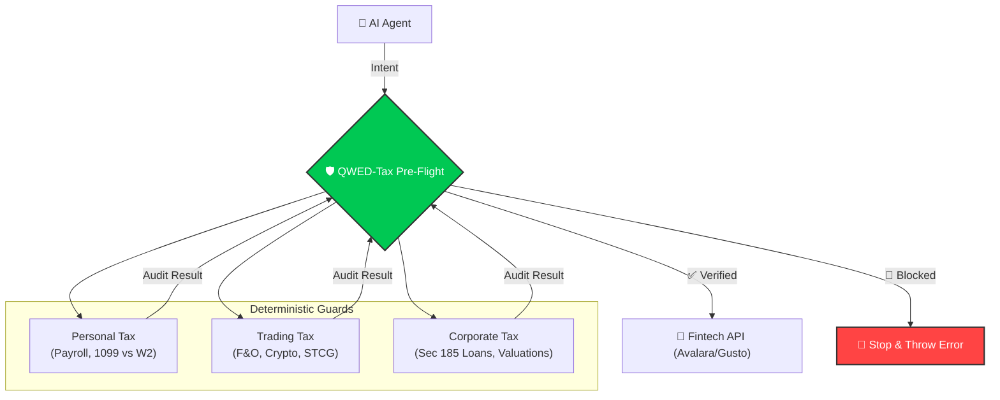

<div align="center">


# 💸 QWED-Tax

**The Verification Gate for AI-Generated Tax Decisions**

> Tax software answers: *"What is the correct calculation?"*
>
> QWED-Tax answers: *"Should this AI-generated tax decision be allowed to execute?"*

QWED-Tax sits between AI agents and execution systems (Gusto, Avalara, Stripe) —
verifying that tax decisions are legally sound before they execute.
Not a calculator. Not a filing platform. A deterministic verification layer
powered by Z3 and Decimal math.

[](https://github.com/QWED-AI/qwed-tax)
[](https://docs.qwedai.com/docs/engines/overview#deterministic-first-philosophy)
[](https://github.com/marketplace/qwed-security)
[](https://pypi.org/project/qwed-tax/)
[](https://www.npmjs.com/package/@qwed-ai/tax)
[](LICENSE)

</div>

---

### ⚔️ Why QWED-Tax?
Unlike calculators (Avalara) or executors (Gusto), QWED is a **Verifier**. We sit *between* the AI and the Execution.

| Solution | What They Do | The Risk | QWED's Role |
| :--- | :--- | :--- | :--- |
| **Avalara / Stripe** | **Calculate** tax based on inputs. | Garbage In, Garbage Out. If AI sends wrong input, tax is wrong. | **The Filter:** We verify inputs *before* API calls. |
| **Gusto / Check** | **Execute** payments and filings. | They execute erroneous commands (e.g., paying a W-2 as 1099). | **The Shield:** We block illegal payments *before* execution. |
| **Blue J / ChatGPT** | **Research** tax law. | Hallucination (85% accuracy). | **The Proof:** We verify the math & logic deterministically. |

## 🚨 The Problem: Unverified AI Tax Decisions

AI agents are making payroll and tax decisions that execute unchecked —
misclassifying workers, miscalculating withholding, and filing incorrect returns.

QWED-Tax is the verification gate:

```
AI-generated tax decision
        ↓
Deterministic verification (Allow / Block / Unverifiable)
        ↓
Execution system (Gusto, Avalara, Stripe)
```

> *"Death, Taxes, and Deterministic Verification."*

## 🏗️ Architecture: The "Swiss Cheese" Defense


```mermaid
graph TD
    A["🤖 AI Agent"] -->|"Intent"| B{"🛡️ QWED-Tax Pre-Flight"}
    
    subgraph "Deterministic Guards"
    C["Personal Tax<br/>(Payroll, 1099 vs W2)"]
    D["Trading Tax<br/>(F&O, Crypto, STCG)"]
    E["Corporate Tax<br/>(Sec 185 Loans, Valuations)"]
    end
    
    B --> C & D & E
    C & D & E -->|"Audit Result"| B
    
    B -- "✅ Verified" --> F["🚀 Fintech API (Avalara/Gusto)"]
    B -- "🛑 Blocked" --> G["🚫 Stop & Throw Error"]
    
    style B fill:#00C853,stroke:#333,stroke-width:2px,color:white
    style G fill:#ff4444,stroke:#333,stroke-width:2px,color:white
```

## 🧠 Procedural Accuracy (MSLR Aligned)
Unlike standard calculators, `qwed-tax` verifies the **procedure**, not just the result. This aligns with **Multi-Step Legal Reasoning (MSLR)** to prevent "Right Answer, Wrong Logic" errors.

*   **Step 1: Sanction Check** $\rightarrow$ Is this transaction legal? (e.g., `RelatedPartyGuard` blocks illegal loans *before* rate checks).
*   **Step 2: Limit Check** $\rightarrow$ Is it within quota? (e.g., `RemittanceGuard` checks LRS limit *before* TCS).
*   **Step 3: Calculation** $\rightarrow$ Apply math.

### 📊 Real World Failures We Blocked (From Audit Logs)
| Scenario | LLM Hallucinations | QWED Verdict |
| :--- | :--- | :--- |
| **Senior Citizen FD** | "Base 7% + 0.5% = 7.50000001%" (Float Error) | 🛑 **BLOCKED** (Exact 7.50%) |
| **Loss Set-Off** | "Set off Intraday Loss against Salary" | 🛑 **BLOCKED** (Illegal Inter-head adjustment) |
| **Crypto Tax** | "Deduct Bitcoin loss from Business Profit" | 🛑 **BLOCKED** (Sec 115BBH violation) |
| **Payroll** | "FICA Tax on $500k = $31,000" | 🛑 **BLOCKED** (Limit is $176k / ~$10k tax) |

## 💡 Verification Coverage


> **Deterministic Tax Verification Layer for AI Agents**
A verification layer for tax decisions supported by `z3-solver` and `python-decimal`. It verifies claims across multiple jurisdictions — it does not calculate, file, or execute.

| Feature | US (IRS) 🇺🇸 | India (CBDT / CBIC / FEMA) 🇮🇳 |
| :--- | :--- | :--- |
| **Engine** | `z3` (ABC Test), `decimal` | `z3` (Intraday Rules), `decimal` |
| **Key Guards** | Payroll, FICA Limit, W-2/1099 | Crypto (Sec 115BBH), GST RCM (7 notified services), CGST/SGST/IGST split |
| **Status** | 🟢 Verification Layer | 🟢 Verification Layer |

> **Note:** Guards verify specific deterministic rules. Full tax compliance (GSTR filing, GSTN integration, HSN/SAC classification) is explicitly out of scope. See [What QWED-Tax Is Not](#-what-qwed-tax-is-not).

## 🚫 What QWED-Tax Is Not

QWED-Tax verifies decisions. It does not originate them, file them, or maintain the data pipelines that compliance platforms require.

Explicitly out of scope:

- **GSTN portal integration** / live GSTIN status lookup — QWED validates GSTIN format and checksum, not registration status
- **GSTR-1 / GSTR-2B / GSTR-3B reconciliation** — filing workflows belong in a compliance platform
- **e-Invoicing / IRN generation** — execution-side operations, not verification
- **HSN/SAC classification** — corpus maintenance is a data-curation problem, not a verification problem
- **Tax filing or return preparation** — QWED verifies claims; it does not originate filings
- **Regulatory change tracking as a service** — notifications, circulars, per-state rate updates
- **Payroll processing or execution** — QWED verifies payroll math; it does not run payroll
- **Tax calculation as a standalone engine** — QWED verifies a claimed result against statutory rules; it does not compute taxes for filing

If a feature requires live data sync, classification-corpus maintenance, or filing workflows, it belongs in a compliance platform — not in QWED-Tax.

## 🛡️ The Guards

### 🇺🇸 United States (IRS)
1.  **PayrollGuard**: Verifies Gross-to-Net logic and enforces **2025 FICA Limit** ($176,100).
2.  **ClassificationGuard (IRS Common Law)**: Uses deterministic rules to verify W-2 vs 1099 status.
3.  **ReciprocityGuard**: Deterministically verifies state tax withholding (NY vs NJ rules).
4.  **NexusGuard**: Verifies **Economic Nexus** thresholds ($100k/$500k sales) to catch missing tax liabilities.

### 🇮🇳 India (CBDT / CBIC / FEMA)
1.  **CryptoTaxGuard**: Enforces **Section 115BBH** (No set-off of VDA losses).
2.  **InvestmentGuard**: Distinguishes **Intraday (Speculative)** from **Delivery (Capital Gains)** using strict rules.
3.  **GSTGuard**:
    *   **Reverse Charge Mechanism (RCM)**: Verifies liability for notified services — GTA, Legal, Security, Director, Sponsorship, Renting of motor vehicle, and Import of service.
    *   **CGST/SGST/IGST split**: Verifies the tax breakup against the place of supply (intra-state vs inter-state).
4.  **RemittanceGuard (FEMA)**:
    *   **LRS Limit**: Enforces $250,000 annual limit per PAN.
    *   **Prohibited**: Blocks Gambling, Lottery, and Racing remittances.
    *   **TCS**: Applies 20% Tax Collected at Source on generic investments/tours.
5.  **Accounts Payable Guards**:
    *   **InputCreditGuard**: Blocks ITC on 'Blocked List' (Sec 17(5)) like Food/Motor Vehicles.
    *   **TDSGuard**: Enforces withholding tax (1% vs 10%) on Contractor/Professional payments.

## 🔒 Zero-Data Leakage
Unlike cloud APIs (Avalara/Vertex), `qwed-tax` runs **100% Locally**.
*   **Privacy First:** Your payroll/trading data never leaves your server.
*   **No API Latency:** Checks are instant (microseconds).
*   **GDPR/DPDP Compliant:** Ideal for sensitive Fintech environments.

> 📖 **See [Determinism Guarantee](https://docs.qwedai.com/docs/engines/overview#deterministic-first-philosophy)** for how QWED ensures 100% reproducible verification.

## 📦 Installation
```bash
pip install qwed-tax
```

## ⚡ Usage
```python
from qwed_tax.verifier import TaxVerifier

# 1. US FICA Check
us_tax = TaxVerifier(jurisdiction="US")
# ... usage (facade methods to be added or verified) ...

from qwed_tax.jurisdictions.us import PayrollGuard
pg = PayrollGuard()
result = pg.verify_fica_tax(gross_ytd=180000, current=5000, claimed_tax=310)
print(result.message) 
# -> "❌ FICA Error: Expected $68.20 (Hit Limit)"

# 2. India Crypto Check
in_tax = TaxVerifier(jurisdiction="INDIA")
res = in_tax.verify_india_crypto(losses={"VDA": -5000}, gains={"BUSINESS": 50000})
print(res.message) 
# -> "⚠️ Section 115BBH Alert: VDA loss cannot be set off."

## 🧾 Accounts Payable Verification
`qwed-tax` verifies tax decisions in the Procure-to-Pay cycle for AI Agents:
*   **Validation:** Checks GSTIN/VAT ID formats.
*   **Verification:** Blocks Input Tax Credit (ITC) on "Personal" categories (Food, Cars, Gifts).
*   **Withholding:** Verifies TDS/Retention amounts before commercial payment.
```

## 🌐 TypeScript SDK
Run verification checks proactively in the browser/frontend.

```bash
npm install @qwed-ai/tax
```

```typescript
import { TaxPreFlight } from '@qwed-ai/tax';

const result = TaxPreFlight.audit({
  action: "hire",
  worker_type: "1099",
  worker_facts: { provides_tools: true, reimburses_expenses: true } // implies Employee
});

if (!result.allowed) {
   alert(" Compliance Block: " + result.blocks.join(", "));
}
```

> 🔐 **Fail-Closed Contract:** `TaxPreFlight` is strict by design. Missing, ambiguous, or unsupported intent payloads are blocked (`allowed = false`) rather than treated as a successful verification.

## ⚡ Usage (Frontend)
```python
from qwed_tax.verifier import TaxPreFlight

preflight = TaxPreFlight()
report = preflight.audit_transaction({
    "action": "hire",
    "worker_type": "1099",
    "worker_facts": {
        "provides_tools": True,
        "reimburses_expenses": True,
        "indefinite_relationship": True
    }, # Employee traits
    "state": "NY", 
    "sales_data": {"amount": 600000} # Crosses Nexus
})

if not report["allowed"]:
    print(f"🛑 BLOCKED: {report['blocks']}")
```

> ℹ️ A claim is considered verified only when a supported `action` is provided and at least one deterministic check is actually executed.

## 📂 Examples
Check the `examples/` directory for runnable scripts:
- `examples/demo_payroll.py`: US FICA & Payroll verification.
- `examples/demo_advanced.py`: Complex Investment & Trading checks.

## 🗺️ Roadmap
Expanding verification guard coverage to more jurisdictions and tax rules.
Check out our **[Detailed Roadmap](ROADMAP.md)** for 2026 plans including:
- 🇬🇧 UK (HMRC) & 🇨🇦 Canada (CRA) Verification Guards
- Transfer Pricing & BEPS Verification Guards
- ERP Verification Connectors — verify tax decisions before they enter SAP/Oracle

## 📦 Related Packages

| Package | Description |
|---------|-------------|
| [qwed-verification](https://github.com/QWED-AI/qwed-verification) | Core verification engine |
| [qwed-finance](https://github.com/QWED-AI/qwed-finance) | Banking & derivatives verification |
| [qwed-mcp](https://github.com/QWED-AI/qwed-mcp) | Claude Desktop integration |

---

## 🤝 Contributing
We welcome contributions from Tax Experts and Developers!
See **[CONTRIBUTING.md](CONTRIBUTING.md)** for guidelines.

## 📄 License
Apache 2.0

---

<div align="center">
  <a href="https://snyk.io"></a>
</div>
